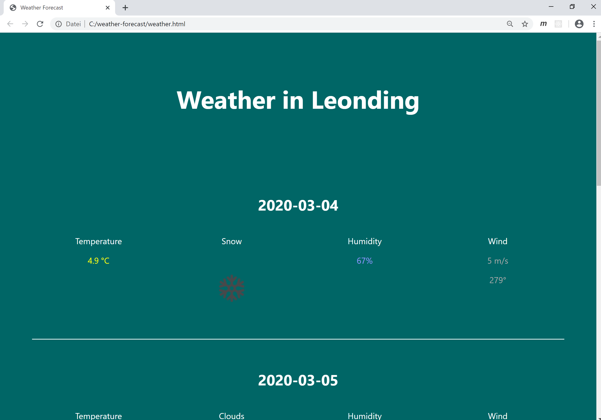
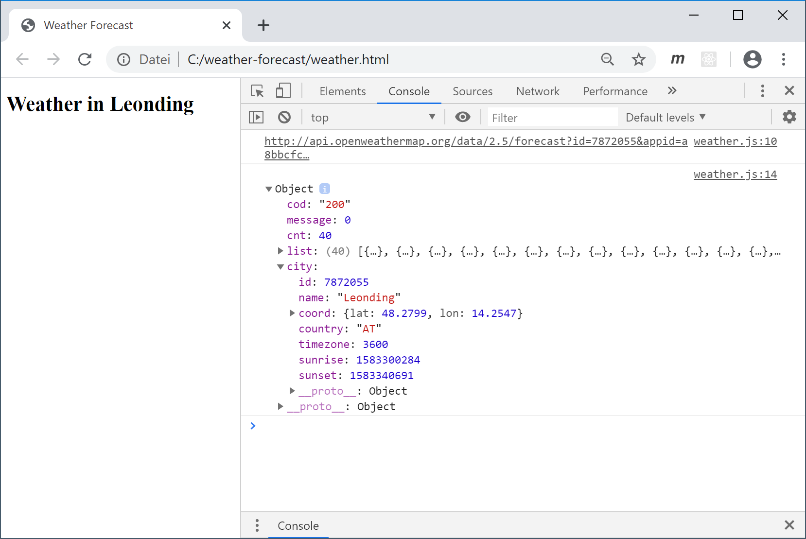
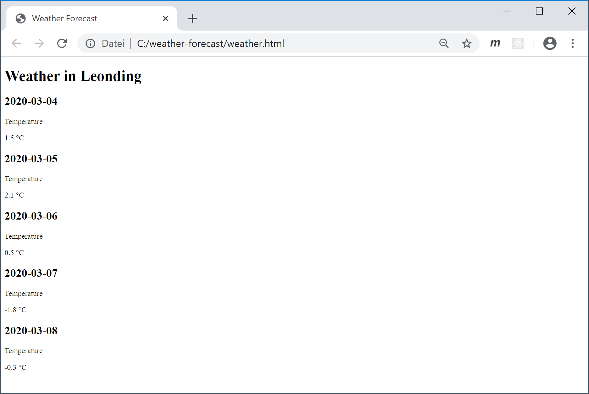
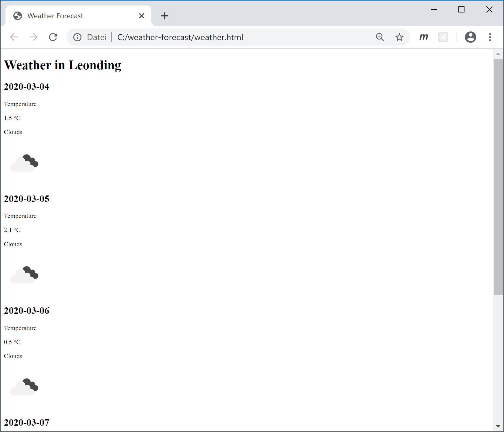
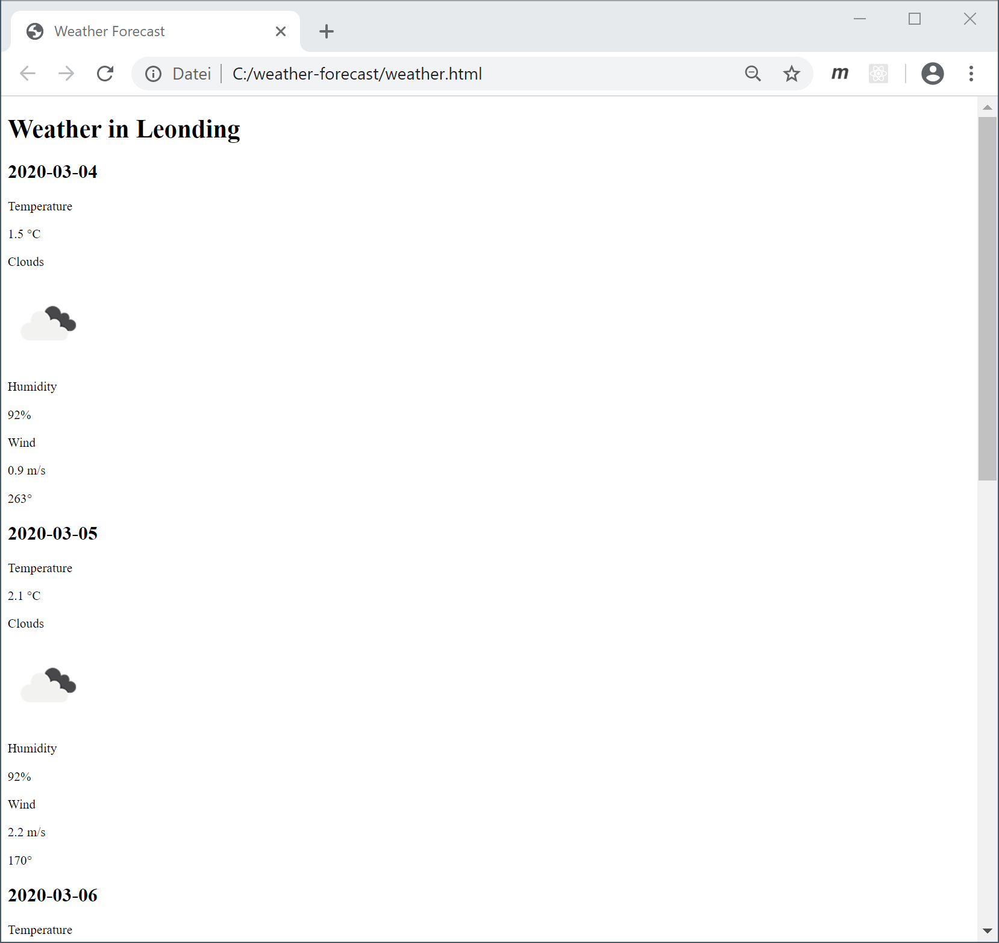

# Weather Forecast

Besuchen Sie die Website unter https://openweathermap.org/forecast5. Diese bietet eine kostenlose API für eine 5-Tages Wettervorhersage an. Ihre Aufgabe ist eine Website zu programmieren, die eine aktuelle Wettervorhersage für Leonding anzeigt:

## Task 1: View JSON Data

Die API ist unter folgender URL verfügbar: [api.openweathermap.org/data/2.5/forecast?id={city id}&appid={your api key}]()

- Die ID von Leonding lautet `7872055`.
- Um die API vor Missbrauch zu schützen, benötigt man für Requests einen Key: `a8bbcfc9596bfb46e4a044c64db39297`

Geben Sie die vollständige URL im Browser ein und untersuchen Sie das abgefragte JSON Objekt. Erstellen Sie einene Screenshot und fügen Sie diesen Ihrem Repository hinzu.

## Task 2: Fetch JSON Data

Implementieren Sie in `weather.ts` die Funktion `loadWeatherForecast()`. Fragen Sie darin die Wettervorhersage für Leonding von der API ab und geben Sie das JSON Objekt auf der Konsole aus.

## Task 3: Show Date & Temperature

Suchen Sie folgende Informationen im JSON Objekt:

- Wo sind die einzelnen Tage zu finden?
- Wo sind die Temperaturen zu finden?
- Wie viele Temperaturwerte werden pro Tag geliefert?

Rufen Sie die Funktion `showWeatherForecast()` mit dem JSON Objekt als Parameter auf. Manipulieren Sie darin das DOM, sodass für die nächsten fünf Tage jeweils das Datum und eine Temperatur angezeigt werden.

## Task 4: Show Weather Conditions

Suchen Sie folgende Informationen im JSON Objekt:

- Wetterbedingungen (sonnig, bewölkt, regnerisch, …)
- Name des dazugehörigen Icons

Erweitern Sie `showWeatherForecast()`, so dass für jeden Tag die Wetterbedingungen und das Icon angezeigt werden.

**Tipp:** Die Icons sind alle online abrufbar. Sie müssen nur den Icon-Namen aus dem JSON Objekt auslesen und den vollständigen Bildpfad zusammenbauen. Beispielsweise ist das Icon mit dem Namen `13d` unter folgender URL verfügbar: http://openweathermap.org/img/wn/13d@2x.png

## Task 5: Show Humidity & Wind

Suchen Sie folgende Informationen im JSON Objekt:

- Relative Luftfeuchtigkeit
- Windgeschwindigkeit und -richtung

Erweitern Sie `showWeatherForecast()`, so dass für jeden Tag die Luftfeuchtigkeit, die Windgeschwindigkeit und die Windrichtung angezeigt werden.

## Task 6: Style Website

Gestalten Sie das Erscheinungsbild der Website mithilfe von CSS.
